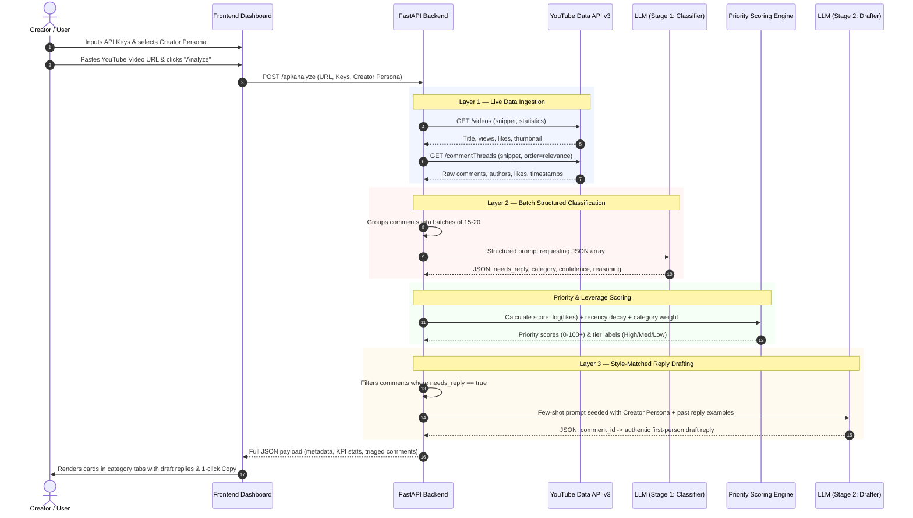

# 🤖 Comment Triage Bot

> **Automated YouTube Comment Management & Response Engine**  
> An intelligent system that ingests YouTube comments, categorizes them into actionable buckets with structured LLMs, scores priority leverage, and drafts replies in the creator's authentic voice.

---

## 🌟 Overview & Problem Statement

A YouTube creator with even a modest audience receives **50–500+ comments per video**. Buried within these threads are:
- ❓ **Genuine questions** the creator should answer to build community trust and engagement.
- 💼 **Sponsor or collaboration pitches** requiring timely business responses.
- 🛡️ **Spam and scam links** (phishing, telegram/whatsapp bots, fake giveaways).
- 🚫 **Toxic or hateful comments** requiring moderation rather than replies.
- 🙌 **Generic positive compliments** that are encouraging but low immediate priority.

Creators typically face two poor choices: spend hours triaging and drafting replies manually, or ignore comments and damage audience retention.

**Comment Triage Bot turns a multi-hour manual task into a focused, 5-minute review session.**

---

## 🏗️ 3-Layer System Architecture

```
┌─────────────────────────────────────────────────────────────┐
│               LAYER 1: DATA INGESTION                       │
│  YouTube Data API v3 (commentThreads.list) / Demo Datasets  │
└──────────────────────────────┬──────────────────────────────┘
                               │
                               ▼
┌─────────────────────────────────────────────────────────────┐
│             LAYER 2: CLASSIFICATION ENGINE                  │
│  Batched Structured LLM (OpenAI / Claude / Smart Fallback)  │
│  Output: needs_reply, category, confidence, reasoning       │
└──────────────────────────────┬──────────────────────────────┘
                               │
                               ▼
┌─────────────────────────────────────────────────────────────┐
│          PRIORITY SCORING & LEVERAGE ENGINE                 │
│  Engagement (log Likes + Replies) + Recency Decay + Urgency │
└──────────────────────────────┬──────────────────────────────┘
                               │
                               ▼
┌─────────────────────────────────────────────────────────────┐
│             LAYER 3: STYLE-MATCHED DRAFTING                 │
│  Second LLM call seeded with Creator Persona & Past Replies │
└──────────────────────────────┬──────────────────────────────┘
                               │
                               ▼
┌─────────────────────────────────────────────────────────────┐
│                 CREATOR STUDIO DASHBOARD                    │
│  Category Tabs, Priority Sort, Draft Editor, 1-Click Copy   │
└─────────────────────────────────────────────────────────────┘
```

---

## 🔄 End-to-End Pipeline & Data Flow

When running with your own **YouTube Data API v3 Key** and **LLM API Key** (OpenAI or Anthropic Claude), the pipeline executes through six coordinated stages:



### Detailed Breakdown of Each Stage

#### 1. Configuration & Input
- The creator configures their **YouTube Data API v3 Key** (`AIzaSy...`) and **OpenAI Key** (`sk-...`) or **Anthropic Key** (`sk-ant-...`) via the web UI settings modal or a `.env` file.
- The creator selects their preferred voice persona (*Friendly & Concise*, *High Energy Hype*, *Deep Tech Expert*, or *Business Executive*) and can supply custom past reply examples for few-shot prompt guidance.
- The creator enters any public YouTube video link (`https://www.youtube.com/watch?v=...`, `youtu.be/...`, or Shorts URL) and triggers analysis.

#### 2. Layer 1 — Live Data Ingestion
- The backend parses the 11-character YouTube Video ID from the URL.
- It calls the **YouTube Data API v3** `videos` endpoint to retrieve video title, channel name, views, likes, and thumbnail:
  ```http
  GET https://www.googleapis.com/youtube/v3/videos?part=snippet,statistics&id={video_id}&key={YOUTUBE_API_KEY}
  ```
- It calls the **commentThreads.list** endpoint to retrieve top-level comments, author display names, profile avatars, like counts, and published timestamps:
  ```http
  GET https://www.googleapis.com/youtube/v3/commentThreads?part=snippet&videoId={video_id}&maxResults=50&order=relevance&key={YOUTUBE_API_KEY}
  ```
- *(If no API key is provided, the application safely falls back to curated sample video datasets and notifies the user with an alert banner.)*

#### 3. Layer 2 — Structured Batch Classification
- Comments are grouped into batches of **15–20 comments per prompt**. Batching significantly decreases API latency and cuts token costs by over 80% compared to per-comment calls.
- The payload is processed with strict JSON schema enforcement:
  - **OpenAI**: Uses `gpt-4o-mini` with `response_format={"type": "json_object"}`.
  - **Anthropic**: Uses `claude-3-5-haiku-20241022` with structured schema constraints.
- The model outputs:
  - `needs_reply`: **Boolean** (`true` for questions and sponsor pitches, `false` for spam, toxic comments, or simple compliments).
  - `category`: **Enum** (`question` | `sponsor_pitch` | `spam` | `toxic` | `positive` | `negative`).
  - `confidence`: **Float (0.0 to 1.0)** reflecting classification certainty.
  - `reasoning`: **String** providing a concise justification displayed in the UI for full transparency.

#### 4. Priority Scoring & Leverage Engine
- The backend ranks comments so the creator sees the highest-leverage interactions first:
  $$\text{Priority Score} = \text{Engagement Score} + \text{Recency Freshness} + \text{Category Urgency}$$
  - **Engagement Score**: $6.5 \cdot \ln(1 + \text{likes}) + 4.0 \cdot \ln(1 + \text{replies})$. Highly upvoted questions reflect topics many viewers want answered.
  - **Recency Freshness**: Exponential decay bonus (e.g. +35 points if posted within 3 hours, +25 if within 12 hours) to maximize YouTube algorithmic engagement momentum.
  - **Category Urgency**: $+35$ for `sponsor_pitch` (direct business revenue), $+25$ for `question` (community retention), $+18$ for constructive `negative` critique (reputation management), and $0$ for spam/toxic.
- Comments are categorized into **High**, **Medium**, or **Low** priority tiers and sorted with actionable items first.

#### 5. Layer 3 — Style-Matched Reply Drafting
- For all comments flagged `needs_reply = true`, a second LLM prompt generates a personalized draft response.
- The prompt is seeded with:
  1. The selected **Creator Voice Persona** (tone, sentence length, emoji frequency).
  2. The creator's **Past Reply Examples** for few-shot style reference.
- Responses are written in the first person ("I", "we"), avoiding robotic filler phrases like *"As an AI..."* and tailoring solutions directly to the comment context.

#### 6. Creator Studio Dashboard & Actions
- The frontend renders an interactive workspace:
  - **KPI Metrics Bar**: Displays total comments, actionable count, questions asked, sponsor inquiries, spam neutralized, and estimated minutes saved.
  - **Category Tabs**: Filter between *All*, *Needs Reply*, *Questions*, *Sponsor Pitches*, *Positive*, *Feedback*, and *Spam & Toxic*.
  - **Inline Draft Editor**: Edit AI-drafted replies directly in the browser.
  - **1-Click Copy**: Copies the customized reply to the clipboard with instant confirmation, ready to paste into YouTube Studio.
  - **Regenerate Draft**: Request alternative drafts on demand.
  - **Export**: Download full reports in **CSV** or **JSON** format.

---

## 🔑 Setup & API Keys Configuration

### 1. YouTube Data API v3 Key (Free)
1. Go to the [Google Cloud Console](https://console.cloud.google.com/).
2. Create a new project (e.g. `Comment-Triage-Bot`).
3. Search for **YouTube Data API v3** in the API Library and click **Enable**.
4. Go to **APIs & Services > Credentials**, click **+ CREATE CREDENTIALS**, and select **API key**.
5. Copy your key (`AIzaSy...`).

### 2. LLM API Key (OpenAI or Anthropic)
- **OpenAI**: Generate an API key from [platform.openai.com/api-keys](https://platform.openai.com/api-keys) (`sk-...`).
- **Anthropic**: Generate an API key from [console.anthropic.com/settings/keys](https://console.anthropic.com/settings/keys) (`sk-ant-...`).

### 3. Adding Keys to the Application
Choose either method:

#### Method A: Directly in the Web UI (Recommended)
1. Open the dashboard in your browser: `http://127.0.0.1:8000`
2. Click **"Creator Voice & Keys"** in the top right header.
3. Enter your **YouTube Data API v3 Key** and your **LLM API Key**.
4. Click **"Save Settings"**. Keys are saved locally in your browser session.

#### Method B: Via `.env` File
Create a `.env` file in the project root:
```env
YOUTUBE_API_KEY=AIzaSyB...xxxxxxxxxxxxxxxxxxxxxx
OPENAI_API_KEY=sk-...xxxxxxxxxxxxxxxxxxxxxx
# Or for Claude:
# ANTHROPIC_API_KEY=sk-ant-...xxxxxxxxxxxxxxxxxxxxxx
```

---

## 🚀 Quick Start Guide

### 1. Prerequisites
- Python 3.10+
- Modern web browser (Chrome, Firefox, Edge, Safari)

### 2. Installation
```bash
# Clone or navigate to the repository directory
cd "e:/Triage Bot"

# Install Python dependencies
pip install -r requirements.txt
```

### 3. Start the Application
```bash
python run_server.py
```
Open your web browser and navigate to:  
👉 **[http://127.0.0.1:8000](http://127.0.0.1:8000)**

### 4. Run Automated Pipeline Tests
To verify all pipeline stages (URL extraction, ingestion, classification, priority scoring, drafting, and REST endpoints):
```bash
python test_pipeline.py
```

---

## ✨ Key Features & Capabilities

- **Style-Matched Reply Drafting**: Seeded with creator tone profiles and past reply examples to maintain authentic human communication.
- **Multi-Factor Priority Scoring**: Automatically bubbles up high-value business leads and top-voted community questions using logarithmic engagement and recency decay.
- **Structured Batch Classification**: Groups comments into batches of 15–20 for fast processing and lower token overhead.
- **Built-in Demo Datasets**: Includes pre-loaded datasets (*AI Agent Tutorial*, *M4 MacBook Pro Review*) for immediate evaluation without requiring API keys upfront.
- **Export Capabilities**: 1-click export of triaged comment reports to CSV or JSON format.
- **Multi-Provider LLM Support**: Works seamlessly with OpenAI (`gpt-4o-mini`), Anthropic (`claude-3-5-haiku`), or built-in local heuristics.

---

## 🛠️ REST API Reference

| Method | Endpoint | Description |
| :--- | :--- | :--- |
| `POST` | `/api/analyze` | Ingests comments, executes batch classification, computes priority scores, and generates draft replies. |
| `POST` | `/api/draft` | Generates or regenerates a draft reply for an individual comment with custom tone parameters. |
| `POST` | `/api/approve` | Marks a comment reply as approved by the creator. |
| `GET` | `/api/sample-videos` | Returns available pre-loaded demo videos for 1-click testing. |
| `GET` | `/api/styles` | Returns available creator voice personas and few-shot examples. |
| `GET` | `/api/export?format=csv\|json` | Downloads the current triage results in CSV or JSON format. |
| `GET` | `/api/health` | Health check endpoint reporting service status and detected API keys. |

---

## 🔮 Future Roadmap

- **OAuth 2.0 Direct Posting**: Allow creators to publish approved replies straight to YouTube without leaving the dashboard.
- **Sentiment Shift Tracking**: Visual timeline tracking audience sentiment trends across the first 7 days following a video drop.
- **Viral Comment Detection**: Early notification trigger flagging comments experiencing sudden bursts of likes or sub-replies.
